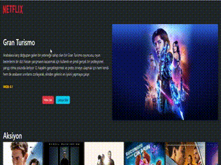

# Movie List App

# Kütüphaneler

- react-router-dom
- @splidejs/react-splide
- axios
- redux
- react-redux
- redux-thunk

# Kaynaklar

- API: https://developer.themoviedb.org/reference/intro/getting-started

- Resim Base UrL : https://image.tmdb.org/t/p/original

# Yapılacaklar

- Redux kurulumunu yap
- Popüler film verisini çek > store ' a aktar.
- Rastgele bir popüler filmisec ve `Hero.jsx` de ekrana bas
- Filmleri kategorisi verisini cek > store a aktar
- Herbir kategori için o kategoriye ait filmleri listeleyecek bir bilesen `ListMovies` bas
- - bu bilesende listelenecek kategorinin ismini
- - ve o kategoriye ait filmleri listele

